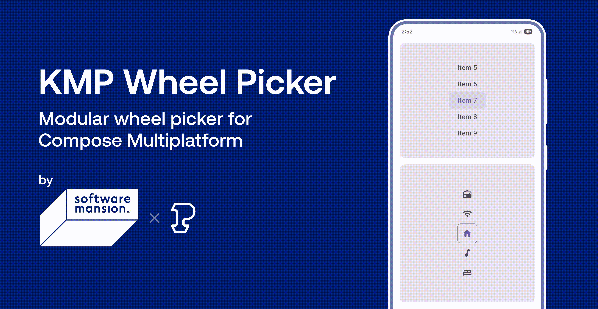

# KMP Wheel Picker




KMP Wheel Picker provides a modular wheel picker for Compose&nbsp;Multiplatform.

## Highlights

- Use your own composables for the items and&nbsp;window.
- Style items based on&nbsp;position.
- Customize the buffer size, animations, and scroll&nbsp;friction.
- Scroll programmatically with an&nbsp;animation.

## Getting started

KMP Wheel Picker is on Maven Central. It supports Android, iOS, desktop, and web
(via&nbsp;Kotlin/Wasm).

```toml
[versions]
kmpWheelPicker = "0.2.0"

[libraries]
swmansion-kmpWheelPicker = { module = "com.swmansion.kmpwheelpicker:kmp-wheel-picker", version.ref = "kmpWheelPicker" }
```

```kts
dependencies { implementation(libs.swmansion.kmpWheelPicker) }
```

## Learning resources

- [“Usage”](#usage)
- [sample&nbsp;app](https://github.com/software-mansion-labs/kmp-wheel-picker/tree/main/sample)
- [API&nbsp;reference](https://software-mansion-labs.github.io/kmp-wheel-picker)

## Usage

Create a
[`WheelPickerState`](https://software-mansion-labs.github.io/kmp-wheel-picker/kmp-wheel-picker/com.swmansion.kmpwheelpicker/-wheel-picker-state/index.html)
instance using
[`rememberWheelPickerState`](https://software-mansion-labs.github.io/kmp-wheel-picker/kmp-wheel-picker/com.swmansion.kmpwheelpicker/remember-wheel-picker-state.html).
Define the item count and, optionally, the index of the initially selected&nbsp;item.

```kt
val state = rememberWheelPickerState(itemCount = 15, initialIndex = 7)
```

Use
[`WheelPicker`](https://software-mansion-labs.github.io/kmp-wheel-picker/kmp-wheel-picker/com.swmansion.kmpwheelpicker/-wheel-picker.html)
to display a wheel picker. Pass in the
[`WheelPickerState`](https://software-mansion-labs.github.io/kmp-wheel-picker/kmp-wheel-picker/com.swmansion.kmpwheelpicker/-wheel-picker-state/index.html)
instance, and define an item&zwj;-&zwj;drawing&nbsp;lambda:

```kt
WheelPicker(state) { Text("Item $it", Modifier.padding(16.dp, 8.dp)) }
```

Add a&nbsp;window:

```kt
WheelPicker(
    state = state,
    window = {
        Box(
            Modifier.background(
                MaterialTheme.colorScheme.primary.copy(alpha = 0.12f),
                MaterialTheme.shapes.small,
            )
        )
    },
) { index ->
    Text("Item ${index + 1}", Modifier.padding(16.dp, 8.dp))
}
```

`bufferSize` defines the number of items shown above and below the&nbsp;window:

```kt
WheelPicker(
    state = state,
    bufferSize = 3,
    window = {
        Box(
            Modifier.background(
                MaterialTheme.colorScheme.primary.copy(alpha = 0.12f),
                MaterialTheme.shapes.small,
            )
        )
    },
) { index ->
    Text("Item ${index + 1}", Modifier.padding(16.dp, 8.dp))
}
```

Style items based on position by comparing their indexes to
[`WheelPickerState.value`](https://software-mansion-labs.github.io/kmp-wheel-picker/kmp-wheel-picker/com.swmansion.kmpwheelpicker/-wheel-picker-state/value.html).
Here, we make the selected item use
[`MaterialTheme.colorScheme.primary`](<https://developer.android.com/reference/kotlin/androidx/compose/material3/ColorScheme#primary()>),
and add fade&zwj;-&zwj;out at the top and&nbsp;bottom:

```kt
private const val BUFFER_SIZE = 3
```

```kt
WheelPicker(
    state = state,
    bufferSize = BUFFER_SIZE,
    window = {
        Box(
            Modifier.background(
                MaterialTheme.colorScheme.primary.copy(alpha = 0.12f),
                MaterialTheme.shapes.small,
            )
        )
    },
) { index ->
    Text(
        text = "Item ${index + 1}",
        modifier =
            Modifier.padding(16.dp, 8.dp).graphicsLayer {
                alpha = (BUFFER_SIZE - abs(state.value - index)).coerceIn(0f, 1f)
            },
        color =
            lerp(
                MaterialTheme.colorScheme.primary,
                MaterialTheme.colorScheme.onSurfaceVariant,
                abs(state.value - index).coerceIn(0f, 1f),
            ),
    )
}
```

Additionally, use `modifier` to add modifiers; `animationSpec` to customize animated scroll and
snapping; and `friction` to adjust the scroll friction, used for&nbsp;snapping:

```kt
WheelPicker(
    state = state,
    modifier = Modifier.align(Alignment.Center),
    bufferSize = 3,
    animationSpec = spring(Spring.DampingRatioLowBouncy, Spring.StiffnessMediumLow),
    friction = 8f,
    window = {
        Box(
            Modifier.background(
                MaterialTheme.colorScheme.primary.copy(alpha = 0.12f),
                MaterialTheme.shapes.small,
            )
        )
    },
) { /* ... */ }
```

[`WheelPickerState.index`](https://software-mansion-labs.github.io/kmp-wheel-picker/kmp-wheel-picker/com.swmansion.kmpwheelpicker/-wheel-picker-state/--index--.html)
stores the index of the currently selected&nbsp;item:

```kt
LaunchedEffect(state.index) { println("Item ${state.index + 1} selected.") }
```

Through
[`WheelPickerState`](https://software-mansion-labs.github.io/kmp-wheel-picker/kmp-wheel-picker/com.swmansion.kmpwheelpicker/-wheel-picker-state/index.html),
you can also access the wheel picker’s
[`InteractionSource`](https://developer.android.com/reference/kotlin/androidx/compose/foundation/interaction/InteractionSource.html)
instance and maximum item height, as well as scroll programmatically, with or without
an&nbsp;animation.

## By [Software Mansion](https://swmansion.com) and [Patryk Goworowski](https://github.com/Gowsky)

Founded in 2012, [Software Mansion](https://swmansion.com) is a software agency with experience in
building web and mobile apps. We are core React Native contributors and experts in dealing with all
kinds of React Native issues. We can help you build your next dream
product&zwj;—&zwj;[hire&nbsp;us](https://swmansion.com/contact/projects?utm_source=kmp-wheel-picker&utm_medium=readme).

[Patryk Goworowski](https://github.com/Gowsky) is a senior Android developer at
[Wakacje.pl](https://www.wakacje.pl/) and coauthor
of&nbsp;[Vico](https://github.com/patrykandpatrick/vico).

[](https://swmansion.com)

[](https://github.com/software-mansion-labs/kmp-wheel-picker/graphs/contributors)
